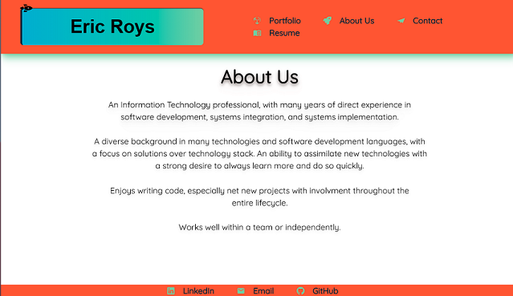
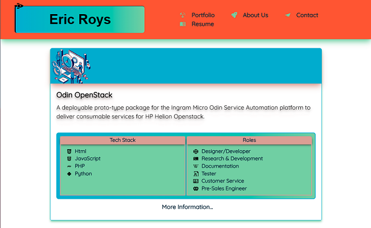
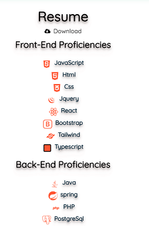
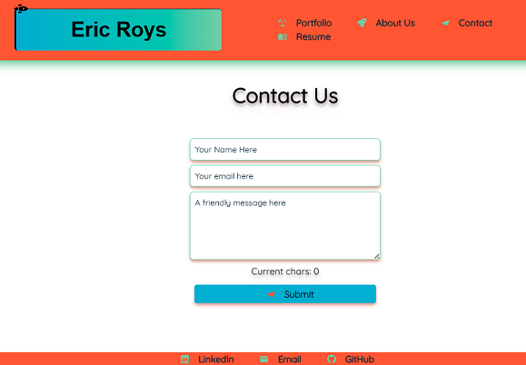
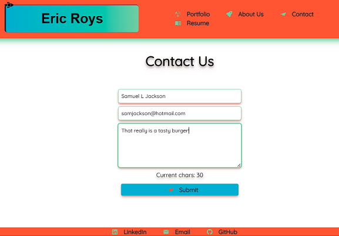
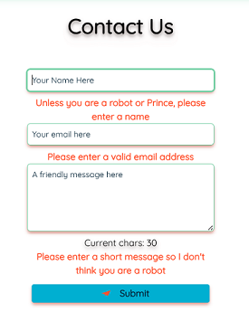
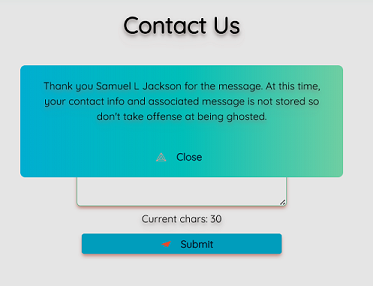

# Portfolio in React + Typescript

## Description

This is a re-make of an earlier project portfolio that was created in simple html and css. For this version the portfolio there are a few more technologies used, the styling is updated, and it encompasses more professional works along with more recent school projects.

## Table of Contents

- [Tech Stack](#tech-stack)
- [General Functionality](#general-functionality)
- [Screenshots](#screen-shots)
- [Installation](#installation)
- [Usage](#usage)
- [Credits](#credits)
- [License](#licensing)
- [Contributing](#contributing)

### Tech Stack

The portfolio application is built using React at the core. TypeScript is used instead of vanilla JS because I prefer to find my mistakes ealy and keep things from being completely open to interpretation. Coming from a Java background, it also makes a lot more practical sense. Tailwind is used for styling, including setting up custom themes and extensions to support the styling needs. React form hook is used for dealing with form handling and Zod is used for validation.

### General Functionality

The web application will display and allow a user to view About Us, Portfolio, Contact, and Resume information. The user can use navigation links to view each as desired. The contact form is functional; however, there is no back-end so submission does not store any information (Go privacy!), but instead displays a modal with confirmation.

### Screen Shots

#### Initial Page Load

When the page initially loads it defaults to the About Us page.

#### Portfolio

The user can view the projects listed in the Portfolio.

#### Resume

The user can view the Resume page which has a listing of front-end and back-end technologies and a link to an actual resume.

#### Contact Us

The user can fill out the contact form

#### Contact Us - Filled Out

#### Contact Us - Validation

#### Contact Us - Confirmation

### Installation

1.  Install Node.js version 20.x or newer
2.  Clone https://github.com/ericroys-school/react-ts-portfolio.git
3.  `cd` into the `react-ts-portfolio` directory
4.  Run `npm i` to load all the project dependencies
5.  Run the program via `node server.js`

### Usage

If you are using from local installation then open the page at http://localhost:3001.
There is an existing deployment via Netlify @ https://warm-sopapillas-6481a3.netlify.app which is free so if it connects slow the first time, have patience, be kind, grab more coffee.

### Credits

No kittens, puppies, armadillos, otter, or octopi were harmed in the making of this project.

### Licensing

As per always, this repo is licensed with [The Unlicense](http://choosealicense.com/licenses/unlicense) so feel free to do whatever. Share with your kids, dogs, neighbors, mail carrier, etc. Have a nice day!

### Contributing

Feel free to reach out via email @ eric.roys@gmail.com if you are interested in a chat about any of the tech used, design decisions, or think the rockets are fun. Tanks, Sherman!
